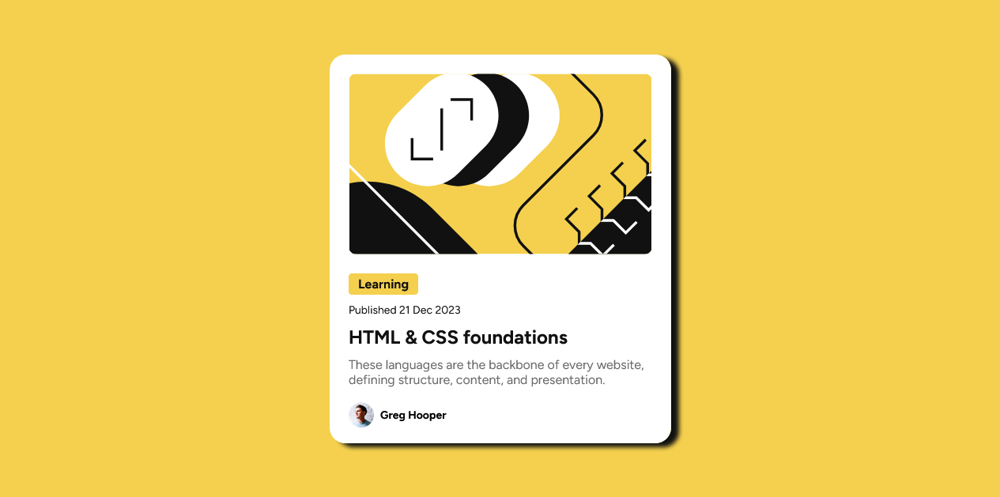

# Frontend Mentor - Blog preview card solution

This is a solution to the [Blog preview card challenge on Frontend Mentor](https://www.frontendmentor.io/challenges/blog-preview-card-ckPaj01IcS). Frontend Mentor challenges help you improve your coding skills by building realistic projects.

## Table of contents

-   [Overview](#overview)
    -   [The challenge](#the-challenge)
    -   [Screenshot](#screenshot)
    -   [Links](#links)
-   [My process](#my-process)
    -   [Built with](#built-with)
    -   [Useful resources](#useful-resources)
-   [Author](#author)

## Overview

### The challenge

Users should be able to:

-   See hover and focus states for all interactive elements on the page

### Screenshot

### Links

-   Solution URL: [Link](https://olaide-hok.github.io/Blog-preview-card/)

### Built with

-   Semantic HTML5 markup
-   CSS custom properties
-   Flexbox
-   Mobile-first workflow

### Useful resources

-   [How to Include a Font .ttf using CSS?](https://www.geeksforgeeks.org/how-to-include-a-font-ttf-using-css/) - This helped me on how to include a .ttf font in a web project using CSS, use the @font-face rule, which allows you to load external fonts and use them throughout your site.

## Author

-   Website - [Habeeb Kareem](https://habeeb-dev.netlify.app/)
-   Frontend Mentor - [@olaide-hok](https://www.frontendmentor.io/profile/olaide-hok)
